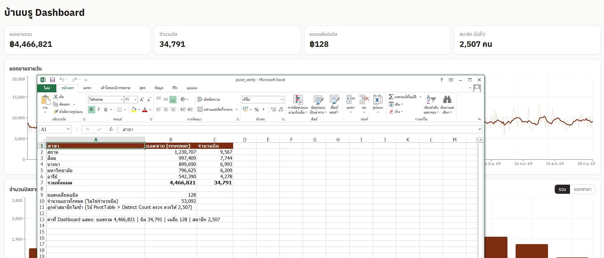

# บ้านบรู Dashboard — งานส่ง Lab 1, การบ้านที่ 1 และการบ้านที่ 2

Dashboard วิเคราะห์ยอดขายและลูกค้าของเครือร้านกาแฟ “บ้านบรู” (ข้อมูลจำลอง 5 สาขา 1 เม.ย. 2025 – 20 ก.ย. 2026) สร้างด้วย React + Vite + Tailwind CSS + Recharts และใช้ AI (Claude Code) ช่วยเขียนโค้ด

**ผู้ส่ง:** atthawat-cha (atthawat.cha@mfu.ac.th) · วิชา Basic Data Analytics & Visualization using AI Vibe Coding (ADT-RAISE Non-Degree Batch 2, โมดูล 3)

---

## 📌 สำหรับอาจารย์: มีงานส่งอะไรบ้าง

| งาน | สิ่งที่ส่ง | ลิงก์ / ไฟล์ |
|---|---|---|
| **Lab 1** · Dashboard แรก | เว็บ Dashboard (KPI 4 ใบ, กราฟเส้นยอดขายรายวัน, กราฟแท่งยอดขายแยกสาขา) + หลักฐานตรวจตัวเลข + โค้ดบน GitHub | เว็บ: **https://baanbrew.web.app** · โค้ด: https://github.com/atthawat-cha/baanbrew-dashboard · หลักฐาน: [`homework/lab1/m3-hw1.png`](homework/lab1/m3-hw1.png) |
| **การบ้านที่ 1** · ต่อจาก Lab 1 | กราฟ “จำนวนบิลตามชั่วโมงของวัน” (รวม / แยกสาขา) พร้อมข้อสังเกต 3 ข้อ | อยู่ในหน้าเว็บเดียวกัน (การ์ดที่ 2 ต่อจากกราฟรายวัน) |
| **การบ้านที่ 2** · ต่อยอด Lab 2.1 | (1) ไฟล์ Colab ทำ Data Profiling `customers.csv` (2) เว็บที่เพิ่มการแสดงผลข้อมูลลูกค้า | (1) [`notebooks/Lab2_1_Customers_Profiling.ipynb`](notebooks/Lab2_1_Customers_Profiling.ipynb) · [เปิดใน Colab](https://colab.research.google.com/github/atthawat-cha/baanbrew-dashboard/blob/main/notebooks/Lab2_1_Customers_Profiling.ipynb) (2) ส่วน **“ลูกค้าสมาชิก”** ท้ายหน้า https://baanbrew.web.app |

> **ลิงก์เว็บที่ใช้ตรวจ:** https://baanbrew.web.app (เลื่อนลงล่างสุดเพื่อดูส่วนลูกค้าของการบ้านที่ 2) ถ้าเห็นหน้าเก่า กด Ctrl+Shift+R เพราะเบราว์เซอร์อาจแคชไว้ไม่เกิน 1 ชั่วโมง

### หมายเหตุที่ควรทราบ
- **หลักฐานตรวจตัวเลข (Lab 1):** ภาพ `m3-hw1.png` เทียบ Dashboard กับไฟล์ Excel ที่ใช้สูตร `SUMIFS` (ไม่ใช่ PivotTable จริง) ตัวเลขตรงกันทุกค่า ถ้าต้องการ PivotTable จริงสามารถทำเพิ่มได้
- **การบ้านที่ 2:** ผล Profiling พบว่าข้อมูลลูกค้า *สะอาดเชิงโครงสร้าง* จึงไม่ลบแถวใด เลือก “ติดธง” จุดที่น่าสงสัยแทน (รายละเอียดด้านล่าง) สมุด Colab รันครบทุกเซลล์บนเครื่องแล้ว และเปิดดูผลลัพธ์ในไฟล์ได้เลยโดยไม่ต้องรันใหม่
- **การใช้ AI:** โค้ดส่วนใหญ่และสมุด Colab เขียนร่วมกับ AI ตัวเลขทุกค่าตรวจซ้ำกับการคำนวณอิสระ (Python/Excel) ส่วนการตัดสินใจเรื่องการจัดการข้อมูลและข้อสังเกตจากกราฟเป็นของผู้ส่ง

---

## ✅ สรุปผลงานแต่ละส่วน

### Lab 1 · Dashboard ยอดขาย
| รายการ | ผลลัพธ์ที่แสดง |
|---|---|
| ยอดขายรวม | ฿4,466,821 |
| จำนวนบิล | 34,791 (นับ `order_id` ไม่ซ้ำ ไม่ใช่นับแถว 53,092) |
| ยอดเฉลี่ยต่อบิล | ฿128 |
| สมาชิกไม่ซ้ำ | 2,507 คน (`customer_id` ที่ไม่ว่าง) |
| กราฟรายวัน | เส้นรายวันจาง + เส้นเฉลี่ย 7 วัน แกน X เป็นวันที่ไทย เช่น 1 เม.ย. 68 |
| กราฟสาขา | สยาม 1,230,707 · สีลม 997,409 · บางนา 899,690 · มหาวิทยาลัย 796,625 · อารีย์ 542,390 |

**การตรวจตัวเลข:** เทียบกับ Excel แล้วตรงทุกค่า (ยอดรวม 4,466,821 และจำนวนบิล 34,791)



### การบ้านที่ 1 · จำนวนบิลตามชั่วโมง
กราฟแท่ง (รวม) และกราฟเส้น (แยก 5 สาขา) สลับได้ที่ปุ่มมุมการ์ด นับบิลด้วย `order_id` ไม่ซ้ำต่อชั่วโมง (ผลรวมทุกชั่วโมง = 34,791 ตรงกับ KPI) พร้อมข้อสังเกต 3 ข้อใต้กราฟ เช่น พีคตอนเที่ยง 12:00 (~3,700 บิล), สีลมพีคเช้า 08:00, สยามและบางนาพีคบ่าย 16:00

### การบ้านที่ 2 · Data Profiling ลูกค้า + แสดงผลบนเว็บ
**ไฟล์ Colab** ([`notebooks/Lab2_1_Customers_Profiling.ipynb`](notebooks/Lab2_1_Customers_Profiling.ipynb)) โครงตามใบงาน Lab 2.1: เตรียมเครื่องมือ → ดูข้อมูล → Profiling (ยังไม่แก้) → ตัดสินใจ → ทำความสะอาดพร้อม log → Verify → Export `customers_clean.csv`

| สิ่งที่ตรวจ | ผล |
|---|---|
| ค่าว่าง / แถวซ้ำ / `customer_id` ซ้ำ | 0 / 0 / 0 |
| รูปแบบ id, เบอร์โทร, วันที่ | ถูกต้องทุกแถว |
| ค่านอกชุดที่อนุญาต (เพศ, กลุ่มอายุ, สาขา) | 0 |
| สมัครก่อนสาขาเปิด / ซื้อก่อนวันสมัคร | 0 / 0 |
| **เบอร์โทรซ้ำข้าม `customer_id`** | **49 เบอร์ (99 แถว)** → ติดธง `phone_shared` ไม่ลบ เพราะเบอร์ถูกปิดบังบางส่วนจึงยืนยันไม่ได้ว่าเป็นคนเดียวกัน |
| **สมาชิกที่ไม่เคยซื้อเลย** | **493 คน (16.4%)** → เก็บไว้ ใช้วิเคราะห์การสมัครแล้วไม่ใช้งาน |
| เพศ “ไม่ระบุ” / อายุต่ำกว่า 18 | 116 คน (3.9%) / 113 คน (3.8%) → เก็บเป็นหมวดแยก ไม่ใช่ข้อผิดพลาด |

**ส่วน “ลูกค้าสมาชิก” บนเว็บ** ใช้ข้อมูลที่ทำความสะอาดแล้ว (`customers_clean.csv`) เชื่อมกับยอดขายด้วย `customer_id` ประกอบด้วย KPI 4 ใบ (สมาชิก 3,000 คน · เคยซื้อ 2,507 คน · ยอดซื้อเฉลี่ย ฿828 ต่อสมาชิก · สัดส่วนยอดขายจากสมาชิก 46.4%) และกราฟ 5 ชุด: สัดส่วนเพศ, กลุ่มอายุ, สมาชิกตามสาขา, ยอดซื้อเฉลี่ยตามกลุ่มอายุ, สมาชิกสมัครใหม่รายเดือน + จำนวนสะสม

---

## 🛠️ รันบนเครื่อง

ต้องมี Node.js 20 ขึ้นไป (`node -v`)

```bash
npm install
npm run dev        # เปิด http://localhost:5173
npm run build      # สร้างโฟลเดอร์ dist
```

**รันสมุด Colab:** เปิดผ่านลิงก์ “เปิดใน Colab” ด้านบน หรืออัปโหลดไฟล์ `.ipynb` ไปที่ colab.research.google.com แล้วรันจากบนลงล่าง เมื่อถึงขั้นโหลดไฟล์ให้อัปโหลด `customers.csv` (และ `sales.csv` ไม่บังคับ) จากโฟลเดอร์ `public/`

## 📁 โครงสร้างโปรเจกต์

```
public/
  sales.csv, products.csv, branches.csv   ข้อมูลของ Lab 1 (sales 53,092 แถว)
  customers.csv                           ข้อมูลลูกค้าดิบ (3,000 แถว)
  customers_clean.csv                     ข้อมูลลูกค้าหลังทำความสะอาด (ผลจากสมุด Colab)
src/
  App.jsx                  หน้า Dashboard (Lab 1 + การบ้านที่ 1)
  Customers.jsx            ส่วนลูกค้าสมาชิก (การบ้านที่ 2)
  lib/metrics.js           logic คำนวณทั้งหมด (แยกจาก UI)
  lib/firebase.js          เชื่อม Firebase / Firestore
notebooks/
  Lab2_1_Customers_Profiling.ipynb   ไฟล์ Colab ของการบ้านที่ 2
  customers_cleaning_log.csv         บันทึกขั้นตอนทำความสะอาด
homework/lab1/m3-hw1.png   หลักฐานตรวจตัวเลขกับ Excel
scripts/seed-firestore.mjs สคริปต์อัปโหลดข้อมูลสรุปขึ้น Firestore
```

## ☁️ Firebase (เพิ่มเติมนอกโจทย์)
- **Hosting:** deploy เว็บที่ https://baanbrew.web.app (`npm run build` แล้ว `npx firebase-tools deploy --only hosting`)
- **Firestore:** เก็บข้อมูลสรุป (`branches` 5, `products` 40, `daily_sales` 538 เอกสาร) กราฟยอดขายรายวันอ่านจาก Firestore และถ้าโหลดไม่ได้จะใช้ข้อมูลจาก CSV แทน Security Rules ให้ทุกคนอ่านได้แต่เขียนจากเว็บไม่ได้
- Firebase web config เป็นข้อมูลสาธารณะของแอป ความปลอดภัยอยู่ที่ Security Rules

## ข้อควรรู้เกี่ยวกับข้อมูล
- 1 แถวใน `sales.csv` = 1 รายการสินค้า (บิลหนึ่งมีได้หลายแถว) · ยอดขาย = `qty × unit_price` · `customer_id` ว่าง = ลูกค้าทั่วไป ไม่ใช่สมาชิก
- วันที่ใช้ 10 ตัวอักษรแรกของ `datetime` (เวลาไทย) ไม่แปลง timezone เพื่อไม่ให้ยอดรายวันเลื่อนไป 1 วัน
- ข้อมูลทั้งหมดเป็นข้อมูลจำลอง ไม่มีบุคคลหรือร้านจริง เบอร์โทรถูกปิดบังบางส่วน
